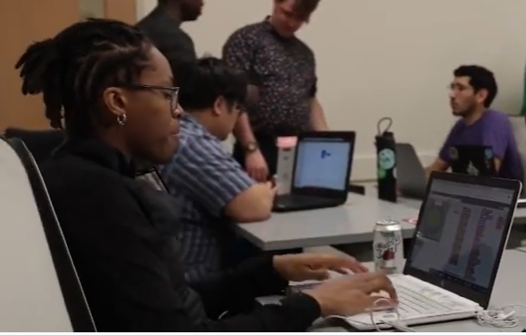
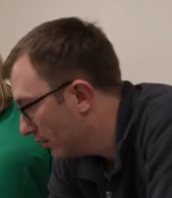
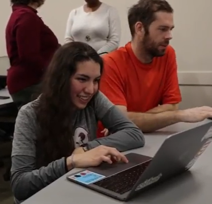
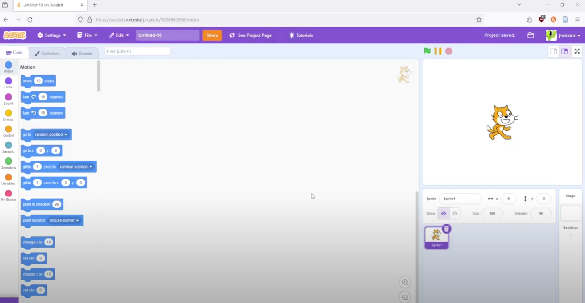

# Introducing Programming Concepts through an Interactive Scratch Workshop
## About ##
LeapforMankind is a racing game created using Scratch. The project aims to teach the concepts of "If statements" and "while loops" through block-coding in Scratch. This project was created through TAP (Technology Ambassador Program) at GGC (Georgia Gwinnett College) which aims to introduce the IT major to audiences that wouldn't have considered the IT field piror to their experience with a TAP workshop.  
## Description ##
* Difficulty Level: Beginner 
* Target Audience: Elementry - Middle school
* Duration of workshop: 60 minutes
* Needed Material: Scratch, A computer with internet access
* The primary goal of this project is teacing participants the basic logical operators and statements, such as ‘if’ statements and ‘while’ loops through block-coding in scratch.
* The audience is introduced to procedural programming through an interactive activity where participants develop their own simple racing game using the Scratch programming language. Participants learn basic logical operators and statements, such as ‘if’ statements and ‘while’ loops.   The use of block code helps simplify coding concepts and makes them more accessible, creating more interest in STEM fields for students.  Through the interactive drag-and-drop architecture of Scratch, students learn how certain algorithms are adopted to create the logic behind a game.
* The Technology Ambassador Program ([TAP](https://www.ggc.edu/academics/school-of-science-and-technology/research-internships-service-learning/technology-ambassador-program)) at GGC strives to break the misconceptions of the IT field by providing fun workshops for students of all backgrounds. TAP students design engaging and fun outreach workshops to encourage interest in IT and STEM.

   ### Commercial Video 
Click the image below to watch a quick commercial for the project    

## Team ##
* Matthew Bauer
* Ryan Cunico
* Valentina Mosquera Reina
* Josiah Williams
### **Advisors** 
* Dr. Cindy Robertson
* Dr. Anca Doloc-Mihu
### Team Photo
 
(Left to Right: Josiah Williams, Ryan Cunico, Valentina Mosquera Reina, and Matthew Bauer) 
***
## Outreach Activities ##
1. Tap Expo - April 28, 2020 - Demonstration the working game to Georgia Gwinnett students and faculty via Zoom. To promote IT field and the TAP program to college students.
2. Online Virtual Workshop - April 21, 2020 - Middle school students to promote IT and STEM careers. 
3. Online Virtual Classroom Workshops - April 7 and April 14, 2020 - Intro to computing and Digital media students to promote IT and STEM careers to non-IT college students.

## Similar Projects ##
* [Scratchathon (Scratch)](https://github.com/TAP-GGC/scratchathon)
* [Makeysrace (Scratch)](https://github.com/TAP-GGC/makeysrace)
* [NinjaTurtler (Scratch with Makey-Makey)](https://github.com/TAP-GGC/NinjaTurtles)
* [Planimals (Scratch)](https://github.com/TAP-GGC/planimals)
* [LightUp (Scratch)](https://github.com/TAP-GGC/LightUp-Teaching-Programming-Basics-with-Scratch)
* [MonsterMakey (Scratch with Makey-Makey - Audio Project)](https://github.com/TAP-GGC/MonsterMakey)

## Technology ##
The technology used in this project is the Scratch programming language. Scratch is a drag-and-drop programming language developed by MIT, which aims to introduce children to programming and logical problem-solving in an interactive, easily digestible manner. Scratch also provides an online community where users can share interactive media such as stories, games, and animation with people from all over the world.  Scratch is designed and maintained by the Lifelong Kindergarten group at the MIT Media Lab (Scratch, n.d.).

|  | 
| :-----------------------------------------------------------: | 
| [Scratch](https://scratch.mit.edu/) |     

## Project Setup/Installation ##
### Guide to Use Scratch

## Game
[Easy:](resources/LeapForMankind.sb3) Take a cruise around a circular track. Vroom Vroom!

[Hard:](resources/LeapForMankindHard.sb3) This is where the fun begins. Drive around a maze.

## Usage
Use your arrow keys to drive around the track. 

## Workshop Instructions

Workshop Slides: [Click Here](documents/ppt/A_Leap_for_Mankind.pptx)

Workshop Step by Step: [Click Here](documents/pdf/Workshop_Step_by_Step_Instructions.pdf)

***
## Demo Video ##

## Workshop Walkthrough Video ##

